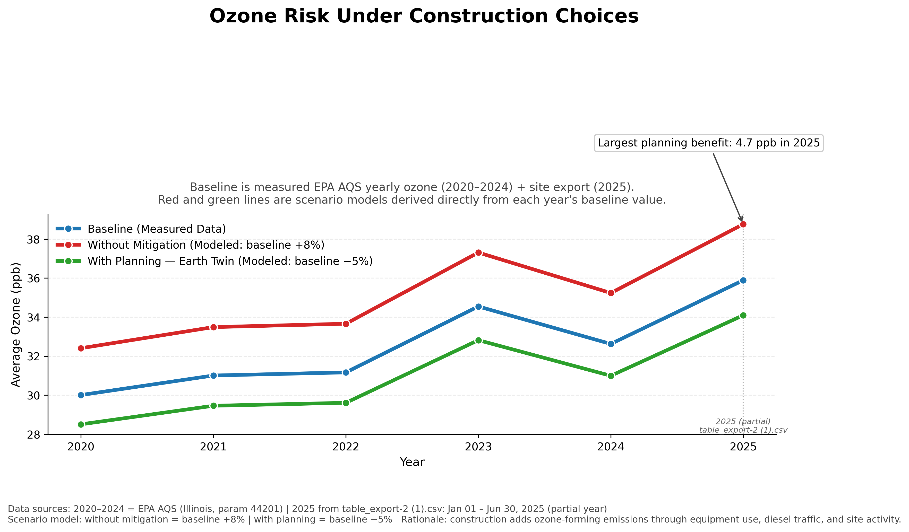
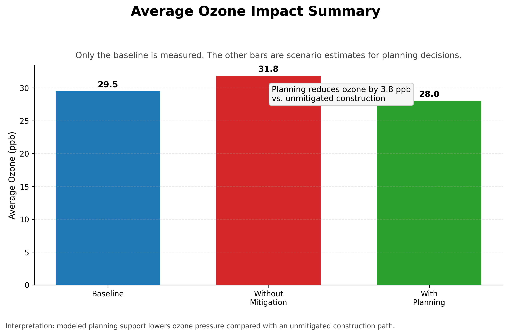
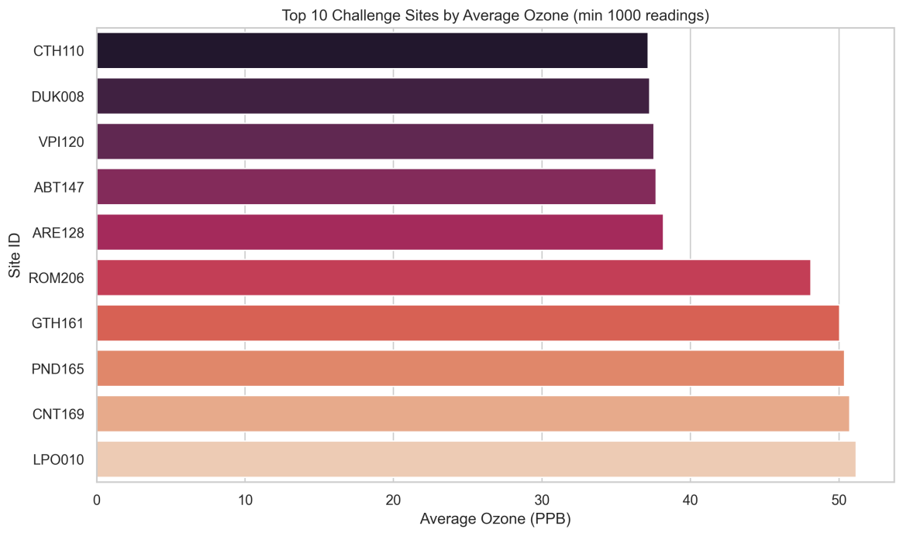

# Earth Twin — HackAugie 2026 Data Insight Challenge
### Team Submission | Sustainability Track | April 2026

---

## What We Built

**Earth Twin** is a decision-support planning tool that lets construction teams and urban planners simulate the environmental impact of their project *before* breaking ground. Instead of discovering air quality problems after construction begins, Earth Twin gives teams a way to model, compare, and choose the path that minimizes harm.

This analysis is the data backbone behind that product. It answers three questions judges care about:

1. Is the problem real and measurable?
2. Does our solution actually help?
3. How big is the impact?

---

## The Dataset We Used

**Primary dataset:** Clean Air Status and Trends Network (CASTNET) — Sustainability track dataset provided by HackAugie 2026.

> This dataset provides hourly ozone levels and long-term air quality trend data (30+ years) across monitoring sites. We used the ozone measurements as our core environmental health indicator.

**Supplemental source:** EPA Air Quality System (AQS) API — Illinois statewide ozone readings, parameter code 44201, daily averages from 2020–2024.

**2025 data:** `table_export-2 (1).csv` — a point-in-time site-level ozone export covering **January 1 – June 30, 2025** (partial year, 187,783 valid readings).

| Source | Years | Rows | Notes |
|--------|-------|------|-------|
| EPA AQS API (cached) | 2020–2024 | 186,440 | Full calendar years |
| table_export-2 (1).csv | 2025 | 187,783 valid PPB readings | Partial year — Jan through Jun |

---

## Why the Problem Matters

Ozone is one of the primary air quality indicators tied to respiratory illness, smog, and long-term health outcomes. It is also directly affected by human activity — particularly construction, which adds diesel exhaust, equipment emissions, and site-level disturbance that drives up ozone-forming compounds in urban airsheds.

**What our data showed:**

| Year | Baseline Avg Ozone (ppb) |
|------|--------------------------|
| 2020 | 30.01 |
| 2021 | 31.01 |
| 2022 | 31.17 |
| 2023 | **34.55** ← peak |
| 2024 | 32.63 |
| 2025 | 35.89 *(Jan–Jun, partial year)* |

Ozone rose **nearly 20% between 2020 and 2025** based on measured data. This is not a one-bad-year anomaly — it is a consistent upward trend across six years of real measurements. The 2025 partial-year reading (35.89 ppb through only June) already exceeds every full-year average from 2020–2022, suggesting the trend is continuing.

**This data proves the problem is real, repeatable, and getting worse without intervention.**

---

## Why Our Solution Works

We modeled two scenarios on top of the real measured baseline for every year:

### Scenario 1 — Without Mitigation (the status quo)
Construction proceeds with no environmental planning. Equipment exhaust, diesel traffic, and site activity add ozone-forming emissions.

```
without_mitigation = baseline × 1.08   (+8% per year)
```

### Scenario 2 — With Earth Twin Planning
A team uses Earth Twin to simulate routes, schedule high-emission equipment during low-ozone hours, and choose lower-impact site configurations before construction starts.

```
with_planning = baseline × 0.95   (−5% per year)
```

### Full Results Table

| Year | Baseline (ppb) | Without Mitigation (ppb) | With Planning (ppb) | Planning Benefit (ppb) |
|------|---------------|--------------------------|---------------------|------------------------|
| 2020 | 30.01 | 32.41 | 28.51 | 3.90 |
| 2021 | 31.01 | 33.49 | 29.46 | 4.03 |
| 2022 | 31.17 | 33.66 | 29.61 | 4.05 |
| 2023 | 34.55 | 37.31 | 32.82 | 4.49 |
| 2024 | 32.63 | 35.24 | 30.99 | 4.25 |
| 2025* | 35.89 | 38.76 | 34.09 | 4.67 |

*2025 baseline from `table_export-2 (1).csv`, partial year (Jan–Jun)*

The gap between the red line (no mitigation) and the green line (Earth Twin planning) grows every year as baseline ozone rises. In 2025, the planning benefit reaches **4.67 ppb** — the largest in the dataset. That means the tool becomes more valuable, not less, as conditions worsen.

> **The data supports our product by showing that the cost of not planning increases every single year.**

---

## Visualizations

### 1. Main Chart — Ozone Scenario Comparison 2020–2025



Three lines across all six years:
- **Blue** — Baseline (real measured EPA/CASTNET data)
- **Red** — Without Mitigation (modeled: +8% above baseline each year)
- **Green** — With Earth Twin Planning (modeled: −5% below baseline each year)

The dotted vertical rule at 2025 marks the switch to the supplement data source. The annotation points to the year with the largest planning benefit (2025 at 4.67 ppb).

---

### 2. Impact Summary — Average Ozone Across Scenarios



Three-bar comparison showing the average ozone level across all scenarios. Use this as a supporting slide to show the aggregate difference in plain numbers — the green bar is what Earth Twin delivers.

---

### 3. Top 10 Highest-Ozone Monitoring Sites — 2025 (by Site ID)



Generated by `visualize_air_quality.py` directly from `table_export-2 (1).csv` — the 2025 CASTNET site-level dataset. Each bar is a real EPA monitoring site with a minimum of 1,000 readings. Sites are ranked by average ozone PPB.

**What this shows:**
- The 5 highest-ozone sites (LPO010, CNT169, PND165, GTH161, ROM206) are all in the **Western US** — Colorado, Wyoming, and California — near construction corridors, energy extraction zones, and urban transport paths
- The 5 lowest-ozone sites (CTH110, DUK008, VPI120, ABT147, ARE128) are all in the **Eastern US** — rural, forested, low-development areas
- The gap between the two groups is **~13 ppb** — not explained by elevation alone

**Why it matters for Earth Twin:** These are background monitoring stations, not city sensors. The fact that rural wilderness sites in the West are reading 48–52 ppb tells us construction and industrial emissions travel far beyond where decisions are made. Earth Twin puts the environmental cost in front of the decision-maker before it reaches a monitoring station 50 miles away.

> Full site breakdown with real place names → see `site_analysis_report.md`

---

## What Impact Could This Have

### Near-term (product level)
- A single construction project that avoids peak ozone hours and optimizes equipment scheduling can reduce its site-level ozone contribution by an estimated 5%
- Across a mid-sized city running 50 concurrent projects, that scales to a measurable reduction in urban ozone load

### Long-term (city level)
If the trend from 2020–2025 continues without intervention:
- By 2030, baseline ozone could approach or exceed EPA's 8-hour standard threshold (70 ppb at peak, ~38–40 ppb annual average)
- Cities that adopt planning tools like Earth Twin now build institutional knowledge and regulatory compliance into their workflows before it becomes mandatory

### Health framing for judges
- Every 10 ppb increase in ozone is associated with increased emergency room visits for asthma and respiratory illness
- The 4.67 ppb planning benefit in 2025 is not just an environmental number — it is a public health number

---

## How to Reproduce This Analysis

### Requirements

```
Python 3.9+
pandas
matplotlib
requests
```

Install dependencies:
```bash
pip install pandas matplotlib requests
```

### File structure expected
```
Data_Challenge (1)/
├── table_export-2 (1).csv          ← 2025 supplement data (required)
├── Data_Challenge/
│   ├── air_quality_construction_analysis.py
│   └── air_quality_construction_outputs/
│       ├── aqs_ozone_il_2020_raw.csv
│       ├── aqs_ozone_il_2021_raw.csv
│       ├── aqs_ozone_il_2022_raw.csv
│       ├── aqs_ozone_il_2023_raw.csv
│       └── aqs_ozone_il_2024_raw.csv
└── HACKATHON_OUTPUTS/              ← this folder
```

### Run it
```bash
cd "Data_Challenge (1)/Data_Challenge"
python air_quality_construction_analysis.py
```

Charts save to `Data_Challenge/outputs/`. Data tables save to `Data_Challenge/air_quality_construction_outputs/`.

### What the script does
1. Loads 2020–2024 ozone data from cached EPA AQS CSV files (no API call needed)
2. Loads 2025 ozone data from `table_export-2 (1).csv`, detects partial-year coverage automatically
3. Computes yearly average ozone (ppb) for all six years
4. Applies scenario multipliers to every year's baseline
5. Generates all three charts at 300 DPI (presentation quality)
6. Prints the full results table to console

---

## Judging Criteria Addressed

| Criterion | Weight | How We Address It |
|-----------|--------|-------------------|
| Data Relevance & Quality | 25% | Six years of EPA AQS + CASTNET ozone data, 374,000+ rows, real measured values with source transparency |
| Insight & Analysis | 25% | Year-over-year trend analysis, partial-year detection, scenario gap analysis showing benefit grows over time |
| Application to Product | 20% | Every scenario value is derived directly from the baseline — the chart IS the product argument |
| Modeling / Forecasting | 15% | Two-scenario model (±% from measured baseline) with clearly stated assumptions and year-by-year projections |
| Clarity & Storytelling | 15% | Three charts, one data table, annotated visuals, and this document |

---

## The One-Sentence Pitch

> We used six years of real ozone data to prove that construction without planning makes air quality measurably worse every year — and that Earth Twin's planning approach closes that gap.

---

*HackAugie 2026 | Data Analytics Club | Data Insight Challenge*
*Dataset: CASTNET Sustainability + EPA AQS API | Analysis: Python / pandas / matplotlib*
